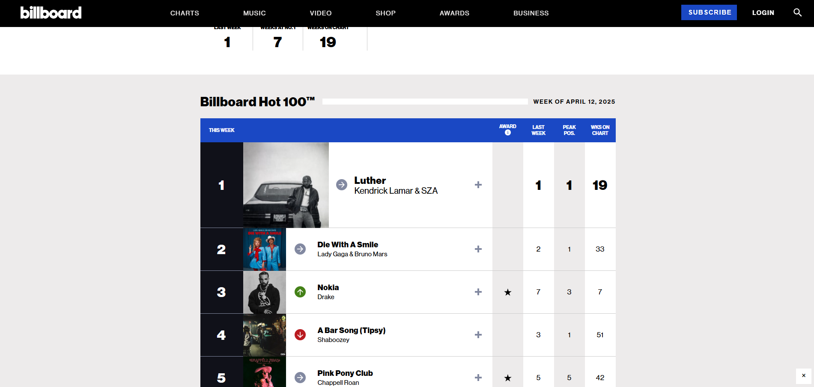
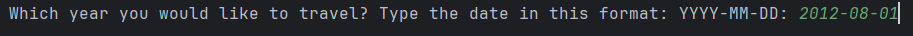
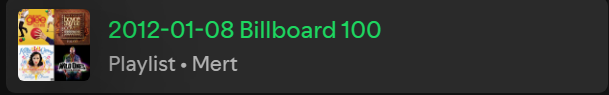

# Billboard-to-Spotify-Playlist

This Python script creates a private Spotify playlist based on Billboard's Hot 100 chart for a specified date.

## Features

- Scrapes Billboard's website for top 100 songs on a specified date.

- Searches for each song on Spotify and adds them to a private playlist.

- Utilizes OAuth 2.0 for Spotify authentication.
- Uses environment variables for API keys and user credentials.
### Result

## Prerequisites

- Python 3
- `requests`, `beautifulsoup4`, `spotipy`, `dotenv` Python packages
- Spotify Developer Account (for client ID, client secret, and redirect URI)
- Billboard API key (optional)

## Installation

1. Clone the repository:

```bash
git clone https://github.com/your-username/Billboard-to-Spotify-Playlist.git
```

2. Install dependencies:

```bash
pip install -r requirements.txt
```

3. Create a `.env` file in the project directory and add your Spotify and Billboard API keys:

```plaintext
CLIENT_ID=your_spotify_client_id
CLIENT_SECRET=your_spotify_client_secret
USER_ID=your_spotify_user_id
```

## Usage

1. Run the script:

```bash
python main.py
```

2. Enter the date in the format `YYYY-MM-DD` when prompted.
3. Check your Spotify account for the newly created playlist.
